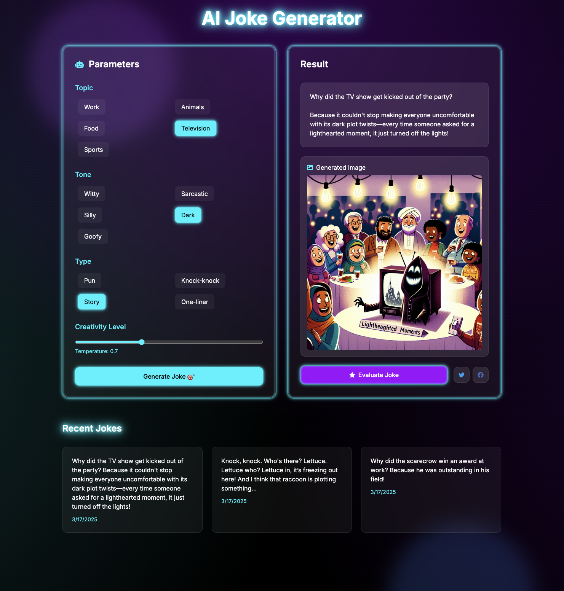

# AI Joke Generator 🤖😄

A modern, futuristic web application that generates AI-powered jokes using GPT-4, complete with text-to-speech and image generation capabilities.



## Features ✨

- **AI-Powered Joke Generation** 🎯
  - Choose from multiple topics (work, animals, food, television, sports)
  - Select different tones (witty, sarcastic, silly, dark, goofy)
  - Various joke types (pun, knock-knock, story, one-liner)
  - Adjustable creativity level

- **Multi-Modal Output** 🎨
  - Text-based jokes
  - AI-generated illustrations
  - Text-to-speech audio playback

- **Smart Evaluation** 📊
  - AI-powered joke analysis
  - Humor rating
  - Appropriateness check
  - Originality score

- **Social Features** 🌐
  - Share jokes on Twitter
  - Share jokes on Facebook
  - Save joke history

## Getting Started 🚀

### Prerequisites

- Node.js 18+ installed
- OpenAI API key
- ElevenLabs API key

### Installation

1. Clone the repository:
```bash
git clone <repository-url>
cd ai-joke-generator
```

2. Install dependencies:
```bash
npm install
```

3. Create a `.env.local` file in the root directory:
```env
# OpenAI API Key
OPENAI_API_KEY=your_openai_api_key_here

# ElevenLabs API Key
ELEVENLABS_API_KEY=your_elevenlabs_api_key_here
```

4. Start the development server:
```bash
npm run dev
```

5. Open [http://localhost:3000](http://localhost:3000) in your browser.

## Usage Examples 💡

### Generating a Joke

1. Select your desired parameters:
   - Topic: Choose from work, animals, food, etc.
   - Tone: Select witty, sarcastic, silly, etc.
   - Type: Pick pun, knock-knock, story, or one-liner
   - Adjust the creativity slider

2. Click "Generate Joke"
3. Wait for the AI to create your custom joke

### Using Text-to-Speech

1. After joke generation, use the audio controls:
   - Play/Pause: Toggle joke narration
   - Stop: Reset audio to beginning

### Sharing Jokes

- Click the Twitter icon to share on Twitter
- Click the Facebook icon to share on Facebook

### Viewing History

- Scroll down to see your recently generated jokes
- Each joke card shows the text and generation date
- Hover over cards for a subtle animation effect

## Technical Stack 🛠

- **Frontend**: Next.js 14, React 18
- **Styling**: Tailwind CSS
- **AI Integration**: GPT-4o-mini
- **Text-to-Speech**: ElevenLabs
- **State Management**: Zustand
- **UI Components**: React Icons

## Contributing 🤝

Contributions are welcome! Please feel free to submit a Pull Request.

## License 📝

This project is licensed under the MIT License - see the LICENSE file for details.
